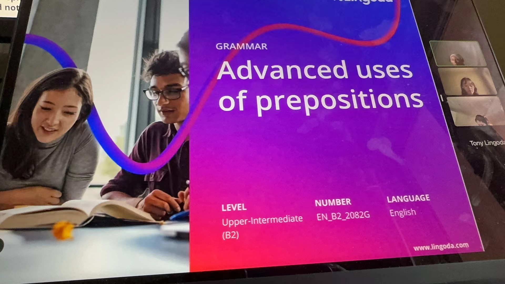


**Topic**: Advanced uses of prepositions
**Related skill**: Grammar  
**Date**: 21 June 2024
**Teacher**: Jennifer (UK)


## What I've learned

### Idioms
**to drive (someone) up the wall**
- Meaning: to irritate or make someone angry
- Example: *The sound of the construction is **driving me up the wall**!*

### Vocabularies & Phrases

|     V&P      |                        Definiation                        |                                    Note                                     |
| :----------: | :-------------------------------------------------------: | :-------------------------------------------------------------------------: |
| rave reviews |                好评如潮；极大赞扬性的评价                 | *The restaurant has rave reviews, but I don't think it's anything special.* |
|  abandoned   |              adj. 被抛弃的；废弃的，被丢弃的              |       *As for the jewels, they were found in an abandoned building.*        |
|   pharmacy   |                   n.	药房；药店；药剂学                   |        *In addition to the bank, the pharmacy is also closing down.*        |
|   liberal    | adj.	宽宏大度的；心胸宽阔的；开明的；（政治经济上）自由的 |     *She is known to have liberal views on divorce and contraception.*      |
|    gerund    |                          n. 动名词                           |                                                                             |

### Expressions

#### In addition to

> - When something **extra** or **additional** is happening, we use **in addition to** + verb in -**ing** form.
> - When something **extra exists** or is **important**, we use **in addition to** + **noun phrase**.

- **In addition to** being pregnant, she is also running a company.
- **In addition to the** bank, the pharmacy is also closing down.

#### Apart from & except for
> **Apart from** is used when we want to **include** a **noun**, **noun phrase** or **an action** with another. We often use **also** and **too**.

***Apart from** English, he also speaks Portuguese.*

> We can also use **apart from** and **except for** to **exclude** a **noun**, **noun phrase** or **action** from another.

- *The shop is open every day, **except for** Sunday.*
- *Everyone is going to the party tonight, **apart from** John.*

#### In spite of
> We use **in spite of** to **contrast** two different things.
> It is followed by a **noun**, **noun phrase**, or **verb in -ing form**

- ***In spite of** the bad weather, we had a good time.*
- *She came to the party **in spite of** being tired.*

#### As for & throughout

> We use **as for** to focus on a **noun phrase** or **action**. It means with regard to or in the case of.

- ***As for** the money, we’ll have to make a decision later.*
- ***As for** your request to move to a different department, unfortunately there are no open positions at the moment.*
 
> **Throughout** means over a whole period of time or in every part of a place.

- *She was asleep **throughout** the film.*
- *He is known **throughout** the world.*

## Review



1/5





Same teacher possibility: 0%



Today's class was my worst Lingoda class experience ever. The teacher, Jennifer, didn't finish all the content in the learning material. She didn't let us read the contents on the sides, and she didn't guided us through the example sentences. Despite this, she still didn't cover all the material. This was becasuse she spend around 10 minutes talking with another classmate about the war in Russia. Additionally, in a grammar class, she let us talk to each other without her for another 10 minutes, and this discussion was completely unrelated to the lesson content. Moreover, she couldn't answer a question asked by another classmate about the material. This class was a complete waste of time. Nonetheless, I still gave her one point for her engagement after I answered the questions.

  

## Resources
- [Learning material](https://learn.lingoda.com/english/learning-materials/666313a804a89/download)
