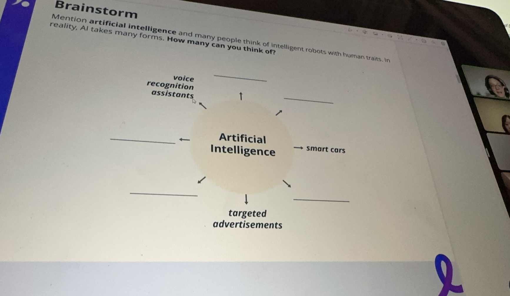


**Topic**: Debating artificial intelligence
**Related skill**: Communication  
**Date**: 24 June 2024
**Teacher**: Francesca (UK)


## What I've learned

### Idioms
**nuts and bolts**
- Meaning: the most important and practical details
- Example: *I met with Susan to discuss the **nuts and bolts** of the deal.*

### Vocabularies & Phrases

|             V&P              |                 Definiation                  |                                                          Note                                                           |
| :--------------------------: | :------------------------------------------: | :---------------------------------------------------------------------------------------------------------------------: |
|         recognition          |          n.	识别；认识；承认；认可           |                                     *I have a voice recognition assistant at home.*                                     |
|           whereas            | conj.	尽管；（用于正式文件中句子的开头）鉴于 |       *No one ever really came to visit us in Madrid, whereas everyone seems to want to come out here to see us.*       |
|          immensely           |               adv. 极其，非常                |                 *Many believe that a self-aware, self-learning machine would grow immensely powerful.*                  |
|         unanimously          |               adv.	全体一致地                |              *The public, experts, and researchers unanimously agree that AI is beneficial for humankind.*              |
|          scepticism          |            n.	怀疑态度；怀疑主义             |                                                                                                                         |
|          neutrality          |              n.	中立；中立状态               |                                                                                                                         |
| a healthy dose of scepticism |                   理性怀疑                   |                  *I have a healthy dose of scepticism when it comes to claims about machine learning.*                  |
|       blind pessimism        |                 盲目悲观主义                 |                                 *Some people look at the future with blind pessimism.*                                  |
|         intellectual         |       adj. 智力的，理智的；才智超群的        |                        *In effect he said he would now look after my intellectual development.*                         |
|           surpass            |             v.	超过；胜过；优于              |                                    *This machine will easily surpass human output.*                                     |
|          outperform          |                v.	超过；胜过                 |                                     *Machines can outperform humans in many jobs.*                                      |
|          eradicate           |                v. 根除，消灭                 |                             *The development of technology could eradicate many diseases.*                              |
|          extinction          |                   n.	绝种                    |                                  *Our extinction could be brought about by machines.*                                   |
|            adopt             |                v. 收养；采取                 | *Furthermore, several tasks traditionally performed by humans have already been adopted by AI, robots, and algorithms.* |
|             wage             |                n. 工资，报酬                 |                        *The automation of many jobs has a negative impact on wages and growth,*                         |
|           dignity            |          n.	尊严；高贵；尊贵；庄严           |        *Mounted on the front around the middle of a long cross-shaped star, a symbol of dignity and solemnity(庄严).*         |
|            render            |          v.	提供；给予；提交；翻译           |                 *The entire world is trying to either undermine your authority or render you obsolete.*                 |
|           obsolete           |            n.	废词；被废弃的事物             |                         *When a subject becomes totally obsolete we make it a required course.*                         |
|             ease             |             n. 容易；舒适，自在              |                        *It's nothing like an old school safety brief to put your mind at ease.*                         |
|      bring (sth) about       |       使（某事物）产生；使发生；引起：       |                                   *This could bring about the end of global poverty.*                                   |
|           reckless           |           adj.	鲁莽的；不计后果的            |                          *Reckless spending brought about the tech company’s collapse(崩溃).*                           |
|           smallpox           |                   n.	天花                    |                      *Certain technological advances can help eradicate diseases, like smallpox.*                       |
|           dominate           |          v.	控制；支配；左右；影响           |                                     *There are fears AI could dominate humankind.*                                      |

## Review



4/5





Same teacher possibility: 30%



Francesca's introduction section was different from other classes. Instead of simply introducing ourselves, she had us introduce one of the most famous things from our hometown. I likeed this section. However, she didn't react much to our answers, which made me feel a little disappointed. Additionally, we had four students today, which was a large class. However, she was not very good at controlling the class. Whenever she asked a question, the class became a little chaotic. She also didn't give detailed and timely feedback, which was different from the teaching style I prefer. In another aspect, Francesca was a very friendly teacher.

  

## Resources
- [Learning material](https://learn.lingoda.com/english/learning-materials/665d9c173dab4/download)
