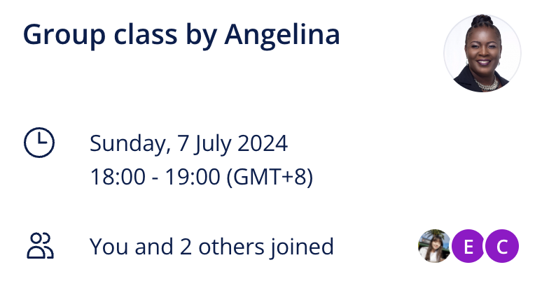


**Topic**: My professional profile
**Related skill**: Communication  
**Date**: 7 July 2024
**Teacher**: Angelina


## What I've learned

### Idioms
**Another string to (your) bow**
- Meaning: to have more than one skill or talent that you can use when you need to
- Example: *: I’ve decided to learn Mandarin. I want to have **another string to my bow** so that I’ll be more attractive to future employers if I ever leave this job.*
  
### Vocabularies & Phrases

|    V&P     |                                           Definiation                                           |                                                             Note                                                              |
| :--------: | :---------------------------------------------------------------------------------------------: | :---------------------------------------------------------------------------------------------------------------------------: |
| accessible | adj. 可到达的，可进入的；易得到的，可使用的；可以理解的，易懂的；平易近人的，随和的；易受影响的 |                                             *I want to make great art accessible*                                             |
| impersonal |                                adj. 非个人的，不受个人感情影响的                                | *The best way to overcome it -- so at least it seems to me -- is to make your interests gradually wider and more impersonal.* |
| highlight  |                                          v.	突出；强调                                          |            *Highlight a few, key achievements instead of listing everything you have done in your career so far.*             |
| milestone  |                              n.	里程碑；转折点；重要事件；重要阶段                              |                              *Graduating from university with top marks was a milestone for me.*                              |  |

### Grammar
> Reviewing use of the '-ing' form

**-ing** can be an ending for *nouns*, *adjectives*, and *verbs*. That makes it difficult to identify what the role of a word is in some sentences – and difficult to follow explanations of English grammar!

So let’s look at a few examples of the **-ing** form and make sure we understand how they work.

| Role                           | Example                                                                  |
| :----------------------------- | :----------------------------------------------------------------------- |
| VERB (PRESENT PARTICIPLE)      | I have been **trying** to understand English grammar for years.          |
| ADJECTIVE                      | English grammar can be really **interesting**.                           |
| VERB PATTERN                   | I enjoy **studying** English grammar.                                    |
| SET PHRASE (BY + -ING)         | By regularly **revising** English grammar, I became better at it.        |
| SET PHRASE (AS WELL AS + -ING) | As well as **mastering** English grammar, I also mastered pronunciation. |
 
#### Verb
As you know, the present participle (-ing) is used to form continuous tenses in English:
- I am still **studying** this example sentence. **(present continuous)**
- I have been **trying** to understand it all day. **(present perfect continuous)**

#### Adjective
Lots of -ing forms can be used as **adjectives** to describe a characteristic:

- English grammar can be quite **frustrating**. 
 
#### Verb pattern
Some verbs such as to enjoy or to consider combine with other verbs in the -ing form:

- I have **considered trying** to get by without grammar, but it’s no good.
 
#### Set phrases
Some set phrases in English use the -ing form. Two important ones are:

- **by + -ing**: This means that doing one thing helped you to do another.
  - **By returning** to the topic again and again, I eventually learned all the uses of  the -ing form in English.

- **as well as + -ing**: This means that in addition to doing one thing, you did another. Both are equally important.
  - **As well as learning** how to use -ing, I learned lots of new vocabulary.

### Expressions

- to be attractive to (a future employer)
  - *Your bio should **be attractive to** a future employer*

- to consider (potential clients)
  - *When writing a bio for your website, **consider** your potential clients.*

- to show your personality
  - *It's nice to **show your personality** in your bio, as well as highlighting your professional achievements.*

- to be passionate about
  - *I**'m passionate about** making high-quality, affordable musical instruments.*

- to stand out from the crowd
  - *Use your bio to **stand out from the crowd** by including some personal details and maybe even some humour!*

- to run (a workshop/event)
  - *Sarah **runs** an after-school book club for teenagers.*

- to hold (a degree in…)
  - *I **hold a degree in Fine Art** from the University of Groningen.*

- to be based in
  - *Our company **is based in** Lisbon, but we also have offices in Marseille and Barcelona.*

- As well as (+ verb –ing)
  - ***As well as** being a full-time dad, I run regular music events in our local pub.*

- to receive (an award)
  - *My mother has **received** many awards for her artwork.*

- to work on (a project)
  - *I have been **working on** this project for months, and it's almost finished.*

## Review



4/5





Same teacher possibility: 50%



## Resources
- [Learning material](https://learn.lingoda.com/english/learning-materials/667fe9bd47b24/download)
