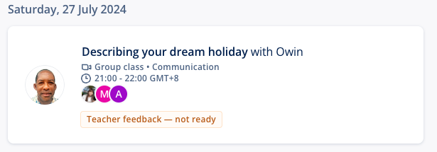


**Topic**: Describing your dream holiday
**Related skill**: Communication  
**Date**: 27 July 2024
**Teacher**: Owin (Trinidad & Tobago)


## What I've learned

### Idioms
**to go the extra mile**
- Meaning: to make an extra effort
- Example: *The hotel staff **go the extra mile** to make their guests happy.*

### Vocabularies & Phrases

|         V&P          |               Definiation               |                                                Note                                                |
| :------------------: | :-------------------------------------: | :------------------------------------------------------------------------------------------------: |
|       must-see       |      必看的东西；必须看；必看不可       |                           *The city has a lot of must-see attractions.*                            |
|    mouth-watering    |             adj.	非常好吃的             |                              *The bakery had mouth-watering treats!*                               |
|  densely-populated   |             na.	人口稠密的              |                                *Tokyo is a densely-populated city.*                                |
|     world-class      |       adj. 世界级的，世界上一流的       |                        *He has potential to become a world-class musician.*                        |
|      fast-paced      |     adj. 快节奏的；快速的；快步调的     |   *When I need to escape the fast-paced life in the city, I take the train to the countryside.*    |
|    awe-inspiring     | adj.	令人惊叹的；使人敬佩的；令人敬慕的 |                      *The Grand Canyon is said to have awe-inspiring views.*                       |
|    breath-taking     |               adj. 惊人的               |                    *The view from the top of the skyscraper was breath-taking.*                    |
|     nature lover     |  自然爱好者：对自然世界有浓厚兴趣的人   |                        *As a nature lover, I enjoy spending time outdoors.*                        |
|     adventurous      |  adj. 勇于冒险的，敢于创新的；爱冒险的  |                 *My cousin Dwayne is adventurous because he likes extreme sports.*                 |
| off the beaten track |  偏僻的地方：在不常被访问的地方或地方   |                *We like to travel off the beaten track and discover something new.*                |
|        foodie        |                n.	美食家                |            *I'm a foodie because I'm really interested in all different kinds of food.*            |
|     can't stand      |             讨厌，无法忍受              |           *I can't stand waiting in line for something that should take no time at all.*           |
|        techie        |            n.	科技通；科技迷            |            *My brother is a techie becasue he loves everything to do with technology.*             |
|      laid-back       |  adj.	〈非正式〉放松的；懒散的；淡然的  |    *My best friend is so laid-back. He's always so calm and nothing ever seems to bother him.*     |
|      easy-going      |     adj.	悠闲的；随和的；不慌不忙的     | *I like travelling with my brother because he's so easy-going. He's always up for doing whatever!* |
|    down-to-earth     |           adj. 实际的；现实的           |                       *It's so easy talking to Sue! She's so down-to-earth.*                       |
|      beach bum       |   海滩迷；海滩小混混；经常光顾沙滩者    |            *I'm such a beach bum. All I want to do on holiday is lounge on the beach!*             |
|      jet-setter      |          n.	常乘飞机旅行的富豪          |                         *He's been all over the world. He's a jet-setter.*                         |
|       glacier        |                 n.	冰川                 |     *Breath-taking mountains and glaciers, beautiful hiking trails and kayak(皮划艇) routes.*      |
|     sightseeing      |              n.	观光；游览              |      *Do not bother sightseeing around the city itself. There is absolutely nothing to see.*       |
|      spiritual       |       adj.	精神的；心灵的；宗教的       |                               *He has gone on a spiritual journey.*                                |

### Expressions
> Using collocations with 'trip' and 'journey'

The words **trip** and **journey** are similar but distinct.

- A **trip** is generally a short break away somewhere - and always ends back where it started. Children go on day-long or week-long school trips, for instance.
  - Field trip
  - School trip
  - Sightseeing trip
  - Business trip
- A **journey** may go on for much longer - and may never end. It can be figurative, too: "Life is a journey", as the old saying goes.
  - Personal journey
  - Cross-country journey

Also, **journey** is the word used for talking about the actual movement from a to b: 'How was your journey?' is what you ask when you want to know whether the train was on time, whether the flight was good, etc. 'How was your trip?' means you are asking about a holiday or a weekend away.

 

#### Collocations with trip and journey
The phrasal verb **go on** is used with both **trip** and **journey**.


We **went on** a *trip* to the seaside last Saturday.
He has **gone on** a spiritual *journey*.


We also use **set off** for the act of starting on a trip or journey.


She **set off** on her *journey* this morning.
They're **setting off** on their *trip* early on Saturday.


You can **take a trip** somewhere, but you can't take a journey.


We **took a trip** to the seaside last weekend.


You **make a journey**.


Thank you for **making the journey**. It's a long way, I know.


## Review



4.5/5





Same teacher possibility: 90%



Owin is the kind of teacher I really like. He gives immediate feedback on our pronunciation after we answer the questions. In addition, he is really well-prepared for this class. He prepares a lot of images related to the new words in the class material to help us learn new words. I also like his teaching style because he lets us explain the meanings of words, helping us remember them and practice speaking at the same time.

## Resources
- [Learning material](https://learn.lingoda.com/english/learning-materials/669bb40487689/download)
