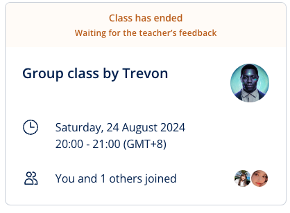


**Topic**: Writing a cover letter
**Related skill**: Communication  
**Date**: 24 Aug 2024
**Teacher**: Trevon (US)


## What I've learned

### Idioms
**a people person**
- Meaning: someone who is outgoing and loves working with people
- Example: *Leah is a real **people person** – she’d be a great tour guide.*

### Vocabularies & Phrases

#### Joining two sentences

> Where one sentence represents something extra, **also** is the most natural link. You can also use **furthermore** or **moreover** in a formal written application. These words are generally followed by a *comma*.

 
| A                                        | Link                               | B                                               |
| ---------------------------------------- | ---------------------------------- | ----------------------------------------------- |
| I am an experienced call-centre manager. | **Also / furthermore / moreover**, | I hold a professional management qualification. |
| I took on several projects in this area. | **Also / furthermore / moreover**, | I participated in various training courses.     |

#### Expressing time and sequence

> You can use words like **before**, **after**, **during**, or **following** at the beginning of a sentence to indicate the order in which you have done things.

- **Before** my degree in Management, I worked in the hospitality industry.
- **After** my degree in Management, I worked in the hospitality industry.
- **During** my degree in Management, I worked in the hospitality industry.
- **Following** my degree in Management, I worked in the hospitality industry.

#### Adding something

> In a job application, **In addition to** is an elegant way of introducing something else you have done. Note that it is used either with a **noun** or with the **-ing** form of a verb.
 
- **In addition to** my qualifications in project management,	I hold a degree in modern languages.
- **In addition to** working in the hospitality sector,	I have been studying for a degree.

### Expressions
> Structuring a cover letter

- **Address your letter to the hiring manager**. Try to find out their name if possible.
- **Tell them why you are** writing, the title of the position, and where you saw the advert.
- **List your skills and experience**: how do you meet the requirements for the position?
- **Tell them how they can contact you**. Let them know you are waiting for their reply.
- **Sign off** with a formal closing. 

## Review



4/5





Same teacher possibility: 50%



Trevon was excellent at offering encouragement and explaining new words and phrases clearly. He also prepared additional learning materials for us. He’s similar to most of the Lingoda teachers.

## Resources
- [Learning material](https://learn.lingoda.com/english/learning-materials/66bb5540b1025/download)
- [Transition Words](https://www.smart-words.org/linking-words/transition-words.html)
