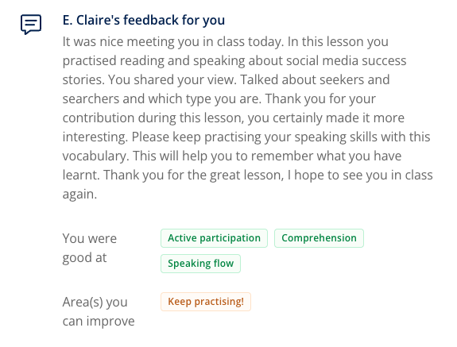


**Topic**: Lingoda-Group-Class-Notes-56.md
**Related skill**: Communication  
**Date**: 7 December 2024
**Teacher**: E. Claire


## What I've learned

### Idioms
**social butterfly**
- **Meaning**: an outgoing person who is charming and charismatic
- **Example**: *Sue is such a **social butterfly**! Everyone adores her!*

### Vocabularies & Phrases

|   V&P    |                                              Definiation                                               |                                     Note                                      |
| :------: | :----------------------------------------------------------------------------------------------------: | :---------------------------------------------------------------------------: |
| striver  |                                      someone who works very hard                                       | *Henry's always known what he wanted to do from a young age. He's a striver.* |
|  seeker  |                            a person who is looking for the thing mentioned                             |    *Tabatha's a seeker because she had to discover what she loved going.*     |
| allergic | If you are allergic to something, you become ill or get a rash when you eat it, smell it, or touch it. |        *I am allergic to almonds. My sister is also allergic to them.*        |

### Expressions
> Contrasting and comparing

#### Comparing
To draw a comparison between two things we see as being alike, we use qualifiers like **both (and)**, particles like **also** and **too**, and the adjectival phrases **similar to** or **like**.


**Both** Instagram and Twitter are picture-heavy.
Facebook has had a lot of bad press. Twitter is **also** coming under fire. TikTok, **too**, is facing criticism.
The way posts spread on social networks is **similar to/like** how rumours spread in the playground.


**Both** can be used as a qualifier (i.e. followed by nouns) or on its own as pronoun (i.e. replacing nouns).

**Both** have their upsides and downsides.


As a qualfier, it can come before or after nouns.


**Both** Instagram and Twitter are picture-heavy.
Instagram and Twitter are **both** picture-heavy.


**Too** can also change position, coming either straight after the subject or at the end of the sentence.


TicToc, **too**, is facing criticism.
TicToc is facing criticism, **too**.


#### Contrasting
To highlight a contrast, we use **unlike** and conjunctions such as **while** or **whereas**.


In the end, Twitter blocked Donald Trump - **unlike** many other networks.
**Whereas** adults have the emotional maturity to process social media, young children are not yet ready for it.
**While** many have turned away from Facebook in recent years, some users remain loyal.


When used for contrasting effect, **while** and **whereas** generally begin sentences.

## Review



4.5/5





Same teacher possibility: 100%



The best teacher on Lingoda!!

## Resources
- [Learning material](https://learn.lingoda.com/english/learning-materials/6748591bdce1b/source/download)

