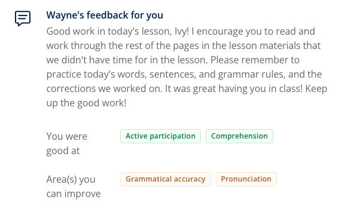


**Topic**: Cryptocurrency  
**Related skill**: Reading  
**Date**: 13 December 2024  
**Teacher**: Wayne  


## What I've learned

### Idioms
**the other side of the coin**

- **Meaning**: a different way of seeing a situation, making it seem better or worse than before.
- **Example**: *Bitcoin succeeded in disrupting the banking sector. However, **the other side of the coin** is that it brought some serious environmental issues with it.*

### Vocabularies & Phrases

|         V&P          |                                          Definiation                                          |                                               Note                                                |
| :------------------: | :-------------------------------------------------------------------------------------------: | :-----------------------------------------------------------------------------------------------: |
|       returns        |                                                                                               |             *Cryptocurrency was seen as an unusual hobby, with little to no returns.*             |
|        set-up        |                                                                                               |          *I have a simple office set-up at home: my desk, computer, chair and printer.*           |
|     specialised      |                                                                                               |                *This job requires specialised knowledge of coding and web design.*                |
|     competitive      |                                                                                               |                    *User experience has become a highly competitive industry.*                    |
|      to verify       |                                                                                               |                  *My bank verifies my payment whenever I buy something online.*                   |
|       downside       |                                                                                               | *The downside to spending so much time online is that we can forget how to socialise in person.*  |
|      difficulty      |                                                                                               | *One difficulty associated with cryptocurrency is that most users do not show their legal names.* |
|    to complicate     |                                                                                               |      *Using bitcoin is further complicated by the fact that it is a decentralised currency.*      |
|       concerns       |                                                                                               |             *Many concerns have been raised about bitcoin's environmental footprint.*             |
|      anonymous       |                                                                                               |                    *Most people who use cryptocurrencies are anonymous users.*                    |
|      to praise       | If you praise someone or something, you express approval for their achievements or qualities. |                *The manager was praised for his strong commitment to the company.*                |
|        shift         |   If someone's opinion, a situation, or a policy shifts or is shifted, it changes slightly.   |             *The study notes a shift towards mobile technology for making payments.*              |
| to address something |                                                                                               |              *Governments need to address issues such as poverty and homelessness.*               |

## Review



4.5/5





Same teacher possibility: 90%



Wayne's feedback are so detailed. He always pointed out my mistakes and correct them immediately. I learnt a lot from his class.

### Feedback for the class

Three Rules for the Pronunciation of **'ed'** when added to the end of present tense verbs to form past tense verbs:  

- ‘ed’ Rule 1: 
  - We ONLY pronounce BOTH letters of 'ed' as ED if the present tense verb ends in a 't' or a 'd', for example: wanted or skidded. 
  - In all other cases we do not pronounce the 'e' of 'ed', we only pronounce the 'd'. 
- ‘ed’ Rule 2. 
  - If a present tense verb ends in any voiced consonant (except d) such as (b, g, j, l, m, n, r, v, w, or z) or in a vowel (a, e, i, o, or u) which are also voiced, we pronounce the 'ed' as D. Examples with present tense verbs that end in voiced consonants: rained, fibbed, killed. Examples with present tense verbs that end in vowels: *lied*, *played*, or *skied*. 
- ‘ed’ Rule 3. 
  - If a present-tense verb ends in any UNvoiced consonant (except t); sounds that are only made with air and are not voiced: such as (f, k, p, s, ch, sh, or x) we do not voice the 'd' either, so we pronounce the 'ed' as T, for example: *asked*, *shipped*, *kissed*, or *fixed*. 
 
Three rules for the pronunciation of 's' when added to the end of words: (These 3 rules apply to all three of the situations where we add an 's' to the end of a word: 

  - We add an 's' when making a singular noun into a plural noun; cat to cats, zebra to zebras. 
  - We add apostrophe 's' when making a noun possessive; Bob to Bob's, Ray to Ray's, Pat to Pat's. 
  - We add an 's' when a verb is in a present tense sentence with a subject that is third person singular; I eat, he eats. We hum, she hums.) 
  
- 'S' Rule 1 
  - When a word ends in a sound that is not voiced, such as (f, k, p, t, or x), we do not voice the 's' either, so it sounds like a normal 's'. For example: *bats*, *ships*, *Jack's*, *Jeff's*, *shoots*, *slips*. 
- 'S' Rule 2 
  - When a word ends in a sound that is voiced, such as any voiced consonant (b, d, g, l, m, n, r, v, w, or y,) or any vowel (a, e, i, o, or u), we voice the 's' also, so it sounds like a 'z'. 
    - Examples with words that end in voiced consonants: *cribs, dogs, Phil's, Brad's, squeals, runs*. 
    - Examples with words that end in vowels: *skis, shoes, Peta's, Anna's, lies, sees*. 
- 'S' Rule 3 
  - The 5 Exceptions; 
    - When a word ends in the sound of ch, j, s, sh, or z, we add 2 sounds that sound like EZ, and we spell them as 'es' for plural nouns and third-person present tense verbs. 
      - Examples that end in 'ch': stiches, Mitch's, teaches. 
      - Examples that end in 'j' sounds: judges, Madge's, abridges. (voice the normally silent 'e') 
      - Examples that end in 's': kisses, boss's, tosses. 
      - Examples that end in 'sh': dishes, Nash's, washes. 
      - Examples that end in 'z': fuzzes, Boz's, fizzes.

**NOTE**: 
- Most people believe that when a name or a word that ends in 's' is made possessive we should only add an apostrophe, and not add apostrophe 's'. 
  - For example: the boss' office, or Chris' car. 
- The crazy part is that we still pronounce it as though we HAD added apostrophe 's'! 
  - For example, boss' is still pronounced as "bossez", Chris' is still pronounced as "Chrisez".

## Resources
- [Learning material](https://learn.lingoda.com/english/learning-materials/673222e9ba163/download)
