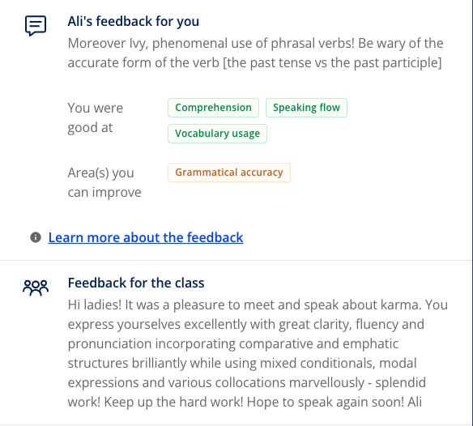


**Topic**: Do you believe in karma
**Related skill**: Reading  
**Date**: 19 December 2024
**Teacher**: Ali


## What I've learned

### Idioms
**to kill someone with kindness**
- **Meaning**: to be so kind to someone that you cause discomfort
- **Example**: *My ex-boyfriend would always **kill me with kindness**. It only made things worse!*

### Vocabularies & Phrases

|       V&P        |                                                          Definiation                                                          |                                                                 Note                                                                  |
| :--------------: | :---------------------------------------------------------------------------------------------------------------------------: | :-----------------------------------------------------------------------------------------------------------------------------------: |
|    to suffer     |                                             to experience physical or mental pain                                             |              *Karma says that if you treat others badly, in time you will come to suffer as a result of those actions.*               |
|    to reward     |                                  something given in exchange for good behaviour or good work                                  |               *If you do good things and treat people well, you will be rewarded by having good things happen to you.*                |
|     origins      |             used to describe the particular way in which something started to exist or someone started their life             |                              *The origins of karma lie in the eastern religions of Buddhism and Taoism.*                              |
|       deed       |                                  an intentional act, especially a very bad or very good one                                   |                               *Helping an elderly lady cross the stress is an example of a good deed.*                                |
| cause and effect |                                                             因果                                                              |                                        *Karma relates to the cause and effect of our actions.*                                        |
|    intention     |                                            something that you want and plan to do                                             |                                    *The intentions behind our actions can either be bad or good.*                                     |
|      energy      |                                  the power and ability to be physically and mentally active                                   |                                       *According to karma, hateful energy does not disappear.*                                        |
|     emotion      |                             a strong feeling such as love or anger, or strong feelings in general                             |                                          *Hate is an example of a strong negative emotion.*                                           |
|    to take on    |                                            表达情感：指以示情感，特别是悲伤或愤怒                                             |                                               *His voice took on a more serious tone.*                                                |
|     ailment      |                               An ailment is an illness, especially one that is not very serious                               |                                        *Children often suffer from minor ailments in winter.*                                         |
|      source      |                            the place something comes from or starts at, or the cause of something                             |                                           *Can you tell me the source of this information?*                                           |
|    to rebound    |                                          to bounce back after hitting a hard surface                                          |                                          *The waves will rebound and return to the centre.*                                           |
|     expanse      |                                         n.  a large, open area of land, water, or sky                                         |                                      *There was a large expanse of water in front of the house.*                                      |
|     balance      |             to give several things equal amounts of importance, time, or money so that a situation is successful              |                                     *It's difficult for me to balance my work and personal life.*                                     |
|  reincarnation   |                            the belief that a dead person's spirit returns to life in another body                             |                                   *Reincarnation refers to returning to life in a different form.*                                    |
|     serenity     |                                            the quality of being peaceful and calm                                             |                                     *If I want to find peace and serenity, I go to my local spa.*                                     |
|   to transform   | to change completely the appearance or character of something or someone, especially so that that thing or person is improved |                                      *She aimed to transform her life by focusing on kindness.*                                       |
|     disturb      |                                              to interrupt what someone is doing                                               | *If a ship or object disturbs the clear and still surface of the water waves will ripple out, away from the site of the disturbance.* |
|  enlightenment   |                                             the state of understanding something                                              |                         *The only way to truly stop bad karma is to reach a stage of calm and enlightenment.*                         |

## Review



4/5





Same teacher possibility: 50%



## Resources
- [Learning material](https://learn.lingoda.com/english/learning-materials/673223ca76333/download)
