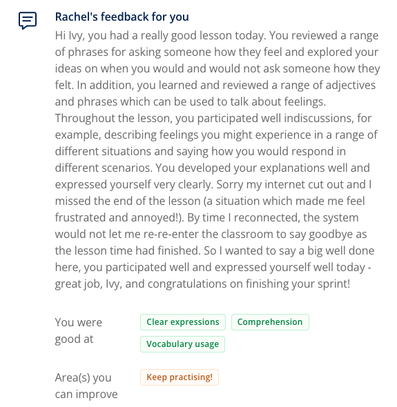


**Topic**: Expressing feelings
**Related skill**: Communication  
**Date**: 22 December 2024
**Teacher**: Rachel


## What I've learned

### Idioms
**to wear your heart on your sleeve**
- **Meaning**: to allow your feelings to be seen by others.
- **Example**: *Eric is one to **wear his heart on his sleeve**. We always know how he’s feeling!*

### Vocabularies & Phrases

|             V&P              |             Definiation              |                                   Note                                    |
| :--------------------------: | :----------------------------------: | :-----------------------------------------------------------------------: |
|          astonished          |            very surprised            |             *I was astonished by how expensive the meal was.*             |
|          devastated          |         completely destroyed         |   *She was devastated when they told her her contract was being ended.*   |
|           thrilled           |   extremely happy about something    |         *I was thrilled when I found out I'd got the promotion.*          |
|           furious            |           extremely angry            |    *We were furious with our parents for forgetting to feed the dog.*     |
|           awkward            |  difficult to use, do, or deal with  | *I felt quite awkward when I realised I didn't know my colleague's name.* |
| to feel down about something |               觉得沮丧               |       *My husband has left me and I'm feeling a bit down about it.*       |
|     to be over the moon      |        兴奋无比；形容无比幸福        |   *We were over the moon with our son's exam results. They were great!*   |
|  to get on someone's nerves  | 使某人心烦意乱：极度令某人烦恼或恼火 |     *My neighbour really gets on my nerves. He makes so much noise!*      |

### Expressions

#### Polity asking about feelings

We can use the following questions to politely ask someone how they're feeling:


- Are you feeling ok?
- Do you have something on your mind?
- What’s the matter?
- Would you like to talk about it?
- Is everything alright?

 

**Matter** can be used as both a **noun** and a **verb**.

*What's the **matter**? Are you okay?* (= as a noun)

*Being open and honest about how you feel **matters** to me.* (= as a verb)


#### Describing feelings
We can use the following, more advanced adjectives to describe how we feel:


- astonished
- devastated
- thrilled
- furious
- awkward


- I felt **awkward** when my boss started shouting at the client.
- I was **thrilled** when they told me I was getting promoted.
 
#### More idiomatic expressions
Here are some more idiomatic ways of describing how we feel:

- to feel **down** about something
- to be **over the moon**
- to **get on** someone's **nerves**


- Tom's complaining really **gets on my nerves**. He needs to stop!

## Review



4/5





Same teacher possibility: 50%



## Resources
- [Learning material](https://learn.lingoda.com/english/learning-materials/674af729d6628/source/download)
