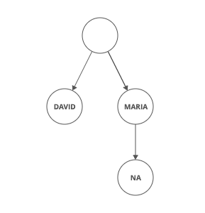

## Definition

The **Trie data structure** is a tree-like data structure used to efficiently **store** and **retrieve** keys in a set of strings. The structure supports operations such as **insertion**, **search** and **deletion** of keys. Some applications of this data structure include **auto-complete** and **spell checker systems**.

### Costs
|        | Worst Case |
| ------ | ---------- |
| space  | $O(n * k)$   |
| insert | $O(k)$       |
| lookup | $O(K)$       |

### Suitable situation
- Tries are useful where you have a fixed dictionary you want to look up quickly

### Strength & Weaknesses
**Strength:**
- Sometimes **Space-Efficient**: If you're storing lots of words that start with similar patterns, tries may reduce the overall storage cost by storing shared prefixes once.
- **Efficient Prefix Queries**: Can do sub string searching in linear time, without pre processing the string every time. Tries also can quickly answer queries about words with shared prefixes, like:
  - How many words start with "choco"?
  - What's the most likely next letter in a word that starts with "strawber"?

**Weaknesses:**
- Usually **Space-Inefficient**: Tries rarely save space when compared to storing strings in a set.
- **Not Standard**: Most languages don't come with a built-in trie implementation. You'll need to implement one yourself.

## Relevant Coding Questions
- [Implement Trie(Prefix Tree)](https://neetcode.io/problems/implement-prefix-tree)
- [LC. 208. Implement Trie (Prefix Tree)](https://leetcode.cn/problems/implement-trie-prefix-tree/description/)

### Python

```python
class TrieNode:
  def __init__(self, val, children=None, isEnd=False):
    self.val = val
    self.children = children
    self.isEnd = isEnd

class Trie:
  def __init__(self):
    self.root = TrieNode('')
  
  def insert(self, word: str) -> None:
    node = self.root
    for ch in word:
      if ch not in node.children:
        node.children[ch] = TrieNode(ch)
      node = node.children[ch]
    node.isEnd = True
  
  def search(self, word: str) -> bool:
    node = self.root
    for ch in word:
      if ch not in node.children:
        return False
      node = node.children[ch]
    return node.isEnd == True

  def startsWith(self, prefix: str) -> bool:
    node = self.root
    for ch in prefix:
      if ch not in node.children:
        return False
      node = node.children[ch]
```

## Similar Data Structures

### Radix Tree
A radix tree is like a trie, but it saves space by combining nodes together if they only have one child.

Here's what a radix tree with *"Maria"*, *"Mariana"*, and *"David"* looks like.



The radix tree with "MARIA", "MARIANA", and "DAVID" where the first node is empty and directs to the children nodes "David" and "Maria", and "Maria" has one children node which contains "NA".
Notice how it has way fewer nodes and links than the trie version we looked at above.

Radix trees are more cache friendly than tries, since the characters within a single node are usually stored in an array of characters, adjacent to each other in memory.

### Others
- ternary search trees
- HAT-tries
- burst tries

## References
- [geeksforgeeks: Trie Data Structure | Insert and Search](https://www.geeksforgeeks.org/trie-insert-and-search/)
- [Stack Overflow: When do we actually use a Trie?](https://stackoverflow.com/questions/10697647/when-do-we-actually-use-a-trie)
- [Interview Cake](https://www.interviewcake.com/concept/java/trie)
