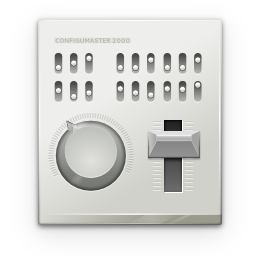
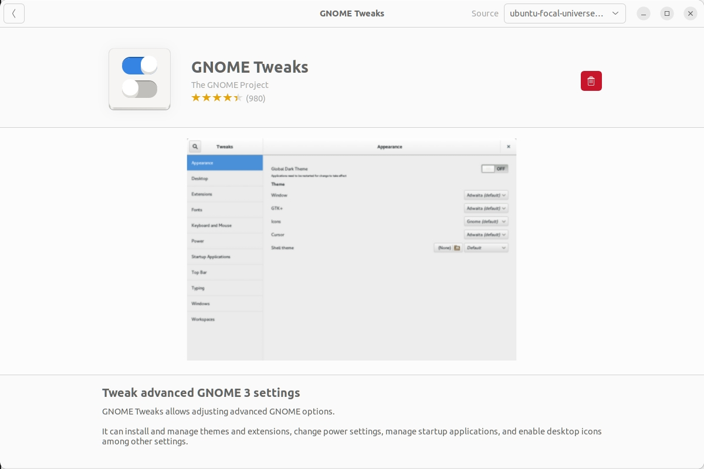
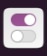
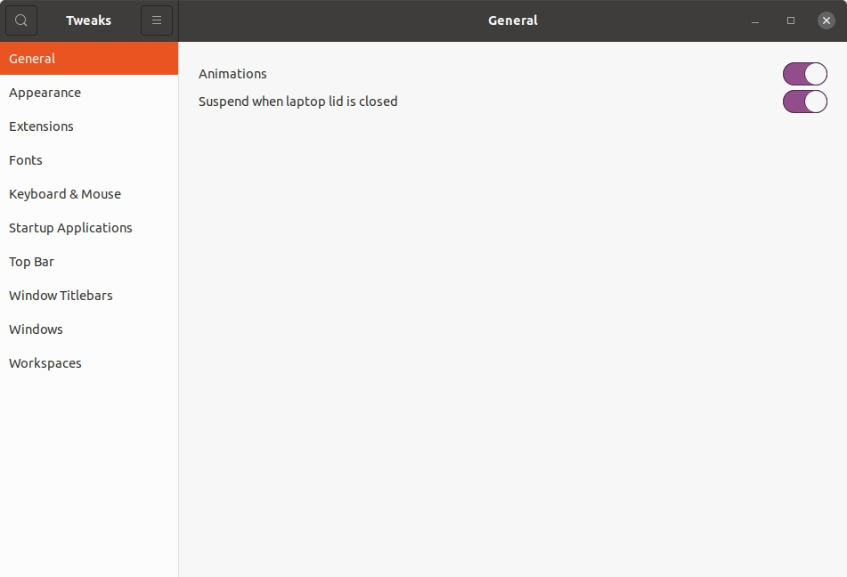
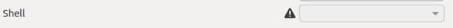
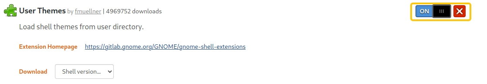
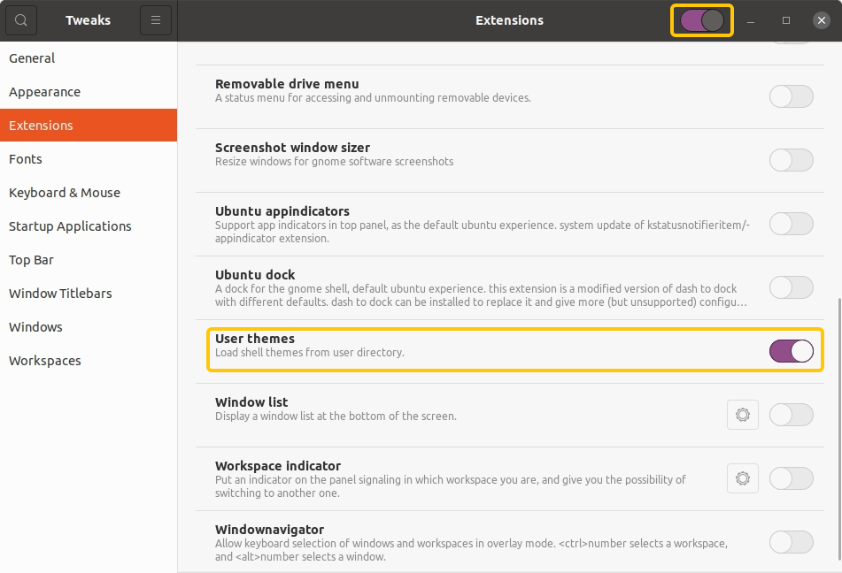
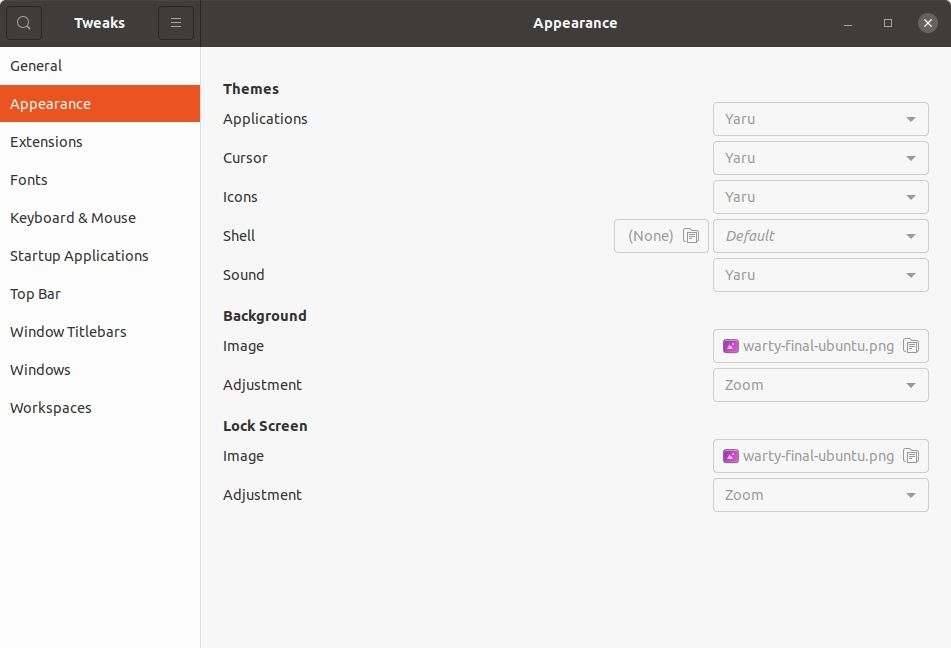
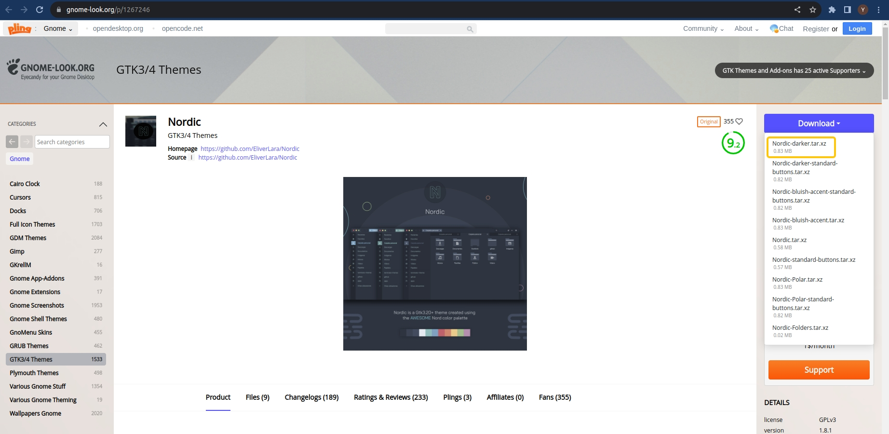
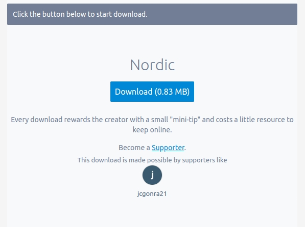


从入职以来，工作电脑一直用的是 Ubuntu 默认主题。看了这么久，着实已经看腻了，所以这次我打算趁着~~摸鱼~~工作间隙，把我的电脑主题更换一下。

<!-- more -->

以下，就是本次的记录

首先，我的系统配置如下:
```
Ubuntu: 20.04
GNOME Shell: 3.36.9
```

## Step 1: 安装 `Gnome Tweaks` 工具
在确认好系统配置之后，就可以进行第一步了 -- 安装 `GNOME Tweaks` 工具


**[GNOME Tweaks](https://gitlab.gnome.org/GNOME/gnome-tweaks)** 是一款在原本设置项目的基础上，能够提供更多自定义设置项的工具，包括了修改主题、修改字体、应用各种扩展工具等等等

  


它的安装有两种方法:

**第一种**: 应用商店搜索 <span class="label label-default">GNOME Tweaks</span> - 下载安装 

  

**第二种**: 使用命令行（*我使用的方法*）

```shell
sudo apt-get update
sudo apt-get install gnome-tweak-tool
```

安装完成之后，就可以从应用程序列表里打开它了

图标长这样:
  

打开之后，长这样:
  

## Step 2: 安装 `User themes` 扩展工具

在 `Gnome Tweaks` 里打开 `Appearance` 后，可能会发现 `Themes` - `Shell` 那里有个感叹号，这是因为没有安装更换主题需要的扩展工具 (Extension)
  

**第一步**: 安装支持扩展工具 (Extension) 的工具

```shell
sudo apt-get install gnome-shell-extensions 
```

安装完成之后，会出现一个这样的图标:


这个图标点开之后，和从 `Tweaks` 打开的 `Extensions` 页面一样

**第二步**: 下载浏览器集成插件

由于之后需要从浏览器下载扩展工具, 所以我们还需要一个浏览器集成插件，我这里使用的是 `Chrome` 浏览器

用命令行安装 `chrome-gnome-shell` 插件

```shell
sudo apt-get install chrome-gnome-shell
```

**TIP**

其他浏览器集成插件的下载方法，可以看这个链接 👉🏻 [https://wiki.gnome.org/Projects/GnomeShellIntegration/Installation](https://wiki.gnome.org/Projects/GnomeShellIntegration/Installation)


**第三步**: 下载 `User Themes` 扩展工具

- 通过浏览器找到 [User Themes Extension](https://extensions.gnome.org/extension/19/user-themes/)
- 把 `OFF` 调成 `ON`

      


**TIP**

其他更多扩展工具，可以看这个链接 👉🏻 [https://extensions.gnome.org/](https://extensions.gnome.org/)


**第四步**: 确认 `User Themes` 扩展工具已经启用

打开 `Tweaks`, 左侧列表找到 `Extensions`, 确认最上面的开关和下面的 `User themes` 的开关都已经打开

  

最后，回到 `Tweaks` 里的 `Appearance` 页面，发现 `Shell` 一栏可以调整了

  

大功告成！🍻

## Step 3: 更换喜欢的主题

前面的准备都已经就绪之后，就可以准备更换主题了


可以在 `GNOME Look` 这里网站，找到 `GTK3/4 Themes` 一栏，从里面选择喜欢的主题下载下来
- GNOME_LOOK.ORG： [https://www.gnome-look.org/s/Gnome/browse/](https://www.gnome-look.org/s/Gnome/browse/)
- 📌 GTK3/4 Themes：[https://www.gnome-look.org/browse?cat=135&ord=rating](https://www.gnome-look.org/browse?cat=135&ord=rating)


以 [Nordic 主题](https://www.gnome-look.org/p/1267246) 为例:

**第一步**: 下载主题压缩包
找到最右边的 `Download`, 它下面会有很多不同的主题包，可以都下载下来一个一个试试看

  

  

**第二步**: 解压压缩包

在主题压缩包下载完成之后，去下载目录里找到它，并通过 `Extract Here` 把它解压到当前文件夹

**第三步**: 移动到主题文件夹下

为了让 `Tweaks` 能够识别到你下载的主题，需要把解压好的文件夹移动到 `/usr/share/themes` 下 


有的教程说也可以移动到 `~/.themes` 下，但我在翻看这些主题的 `issues` 板块时，发现有很多反馈说移动到 `~/.themes`之后，出了各种各样的问题，所以还是直接移动到 `/usr/share/themes` 比较好。


移动的时候，可以直接使用 `mv` 命令

```shell
sudo mv Nordic /usr/share/themes
```

**第四步**: 重启 `Tweaks`, 并更换主题

进入 `Appearance`, 把 `Applications` 和 `Shell` 更换为新的主题 

All done！🍻

## 题外话

一般来说，按照评分从高到低选择自己喜欢的主题下载就可以了。但我在选择主题的时候，遇到了有些主题和我的系统不适配的情况。在我浏览了它们所有的 `issues` 都没有找到解决方案的情况下，只好换成了只有一般般喜欢的主题 😿

当然，除了主题之外，也可以从 `GNOME-LOOK` 上下载自己喜欢的图标、鼠标样式等等等等等等
